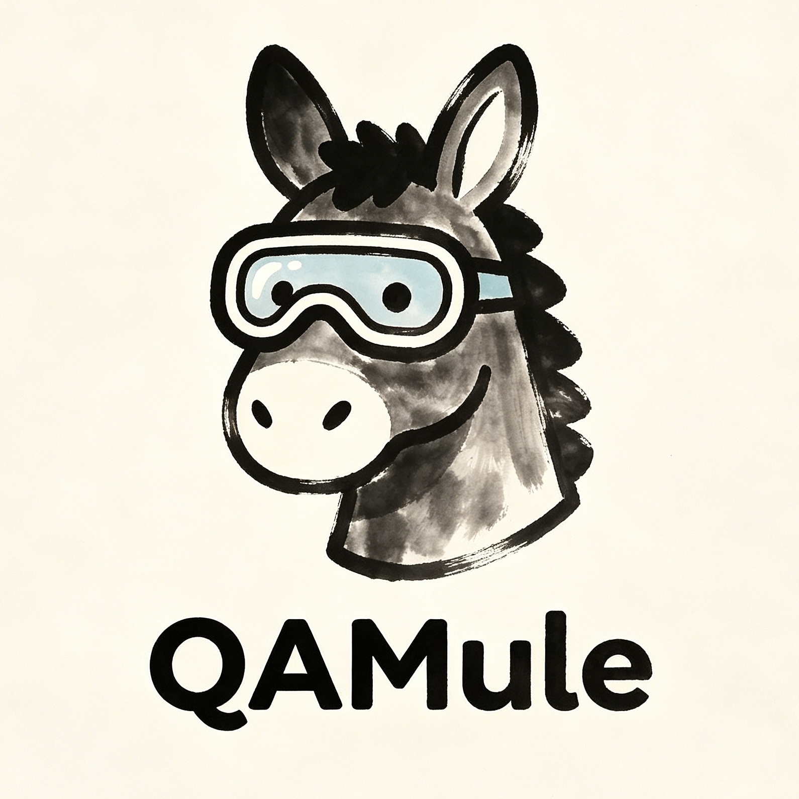

<p align="center">
  
</p>

<h1 align="center">QAMule</h1>

<p align="center">
	Agent-native Android QA solution where the agent is the primary executor.
</p>

<p align="center">
	Explore live apps, preserve failure state, distill stable flows into pytest, and accumulate reusable product knowledge.
</p>

---

## Meet QAMule

QAMule is an **agent-first Android QA solution** for teams that want AI to execute tests on real devices, not just generate scripts.

It starts from live exploration and validation: the agent inspects the app, acts on the device, preserves useful failure state, and writes reusable knowledge back into `knowledge-base/`.

| | Traditional Test Automation | QAMule |
|---|---|---|
| **Primary executor** | Scripts | AI agent |
| **AI Role** | Generate or maintain scripts | Execute, validate, and diagnose directly |
| **Scripts** | Required upfront | Optional, distilled for faster replay |
| **Failure handling** | Snapshot only; environment is lost | Failure state is preserved for inspection and recovery |
| **New scenarios** | Write scripts first, then validate | Explore and test directly on the live device |
| **Knowledge retention** | Scattered across scripts and human memory | Continuously written into the knowledge base for reuse |

## Quick Start

In a few commands, you can explore a page, test a feature, collect a real-device trajectory, and keep the resulting knowledge for reuse.

### Prerequisites

- An Android device connected over USB, or an emulator
- [UV](https://docs.astral.sh/uv/getting-started/installation/) for managing the Python environment and dependencies
- [ADB](https://developer.android.com/tools/releases/platform-tools), the Android Debug Bridge

### Installation

1. Install QAMule into your project as an agent plugin:

```bash
# GitHub Copilot
copilot plugin marketplace add qamule/qamule
copilot plugin install qamule@qamule

# Claude Code
/plugin marketplace add qamule/qamule
/plugin install qamule@qamule

# VS Code
# command + shift + p -> "Chat: Install plugin from Source" -> "qamule/qamule"
```

2. Initialize the project structure:

```
/qamule setup <your_project_name>
```

This sets up a base UV project for QAMule and installs the required dependencies.

### Usage

`@QA` means selecting the QA agent to execute the command, while `@Distiller` means selecting the Distiller agent to execute the command.

`/knowledge-base` means using the `knowledge-base` skill to read or record reusable testing knowledge.

#### Old QAMule Project Migration

If you have an existing QAMule project, you can migrate it to the new structure by running:

```text
/qamule qamule-project-migration
```

#### Insert Knowledge

```text
/knowledge-base Record that this app cannot be launched reliably through adb and must be entered through the in-app UI flow
```

#### Explore a Page

```text
@QA Explore the Settings app home page
```

#### Test a Feature

```text
@QA Validate that the Bluetooth toggle in Settings can be enabled and disabled correctly
```

#### Run Existing Test with Real-Time Report on Pause Mode

```Test
@QA Run existing tests on pause mode with real-time report
```

#### Collect training trajectory

```text
@Distiller Collect one real-device trajectory for opening the Bluetooth settings page in com.android.settings
```

#### View the Trajectory in Web Page

```text
@Distiller Open the trajectory in the web page
```

## License

[MIT](LICENSE) (c) 2026 QAMule
